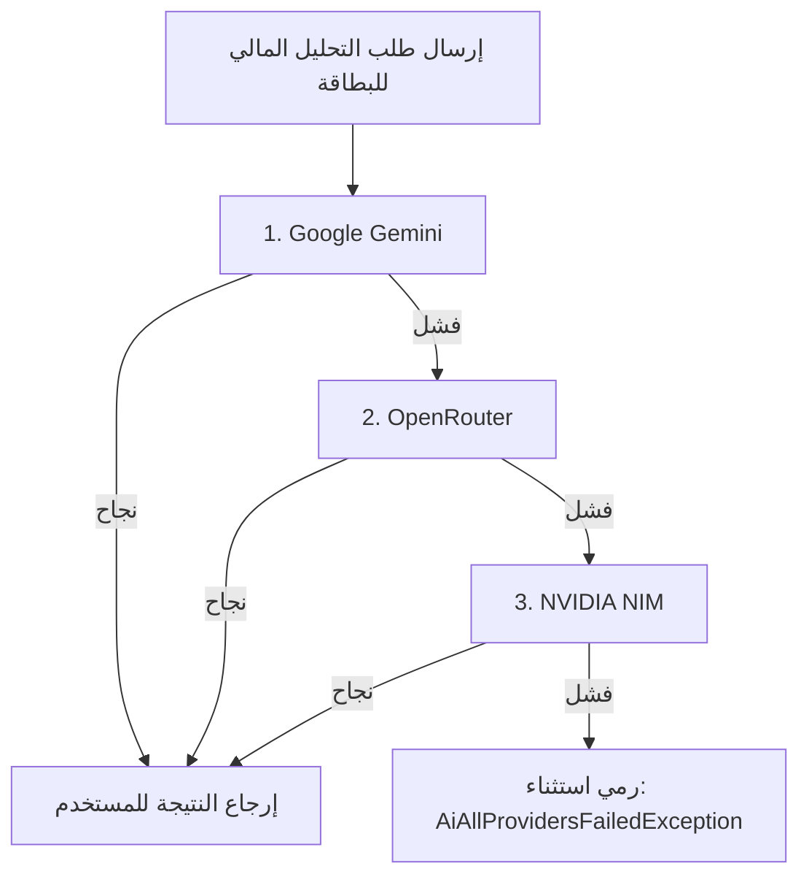

# دليل نماذج ومزودي الذكاء الاصطناعي وأكواد الـ API في تطبيق FinTrack-DZ

يحتوي تطبيق **FinTrack-DZ** على بنية تحتية مرنة للذكاء الاصطناعي تدعم التعامل مع نماذج متعددة من مزودين مختلفين لضمان استقرار الخدمة وسرعتها وتوفير بدائل تلقائية (Fallback Chain) في حال حدوث انقطاع أو فشل في أي خدمة.

---

## 1. الهيكلية العامة للذكاء الاصطناعي في التطبيق
ينقسم الذكاء الاصطناعي في التطبيق إلى مسارين رئيسيين:
1. **مساعد اللوحة الجانبية والدردشة العامة (General AI Chat & Analytics Screen)**: يدار عبر ملف `AiRepositoryImpl.kt` ويستخدم التوجيه والتبديل المباشر بين النماذج.
2. **مساعد البطاقات الإحصائية الذكي (Card AI Assistant)**: يدار عبر سلسلة من الموفرين بتصنيف مستقل (`AiProvider`) تدعم التنقل التلقائي بين الموفرين الأساسيين والاحتياطيين (Gemini ← OpenRouter ← NVIDIA NIM).

---

## 2. مزودو الخدمة وترتيب سلسلة البدائل (AI Providers & Fallback Chain)

### المسار الأول: مساعد البطاقات الإحصائية (Card AI Assistant)
يتبع المساعد الترتيب التالي عند إرسال أي طلب:



#### تفاصيل موفري مساعد البطاقات:

| الموفر | صنف برمجيات المزود | الرابط الأساسي للـ API | النماذج المستهدفة بالترتيب (Candidate Models) | وقت مهلة الاتصال (Timeout) |
| :--- | :--- | :--- | :--- | :--- |
| **1. Google Gemini** | `GeminiProvider` | `https://generativelanguage.googleapis.com/v1beta/` | `gemini-2.5-pro`<br>`gemini-2.0-flash`<br>`gemini-1.5-pro`<br>`gemini-1.5-flash`<br>`gemini-1.0-pro`<br>`gemini-1.0-flash` | 12 ثانية |
| **2. OpenRouter** | `OpenRouterProvider` | `https://openrouter.ai/api/v1/chat/completions` | `google/gemini-2.5-pro`<br>`google/gemini-2.5-flash:free`<br>`google/gemini-2.5-flash`<br>`openai/gpt-4o-mini` | 12 ثانية |
| **3. NVIDIA NIM** | `NvidiaProvider` | `https://integrate.api.nvidia.com/v1/chat/completions` | `meta/llama-3.1-8b-instruct`<br>`nvidia/llama-3.1-nemotron-70b-instruct`<br>`meta/llama-3.3-70b-instruct` | 12 ثانية |

---

### المسار الثاني: اللوحة الجانبية والدردشة العامة (AiChatScreen)
يعتمد على خريطة النماذج البديلة المعرفة داخل `AiRepositoryImpl.kt` كالتالي:

```kotlin
private val modelFallbackMap = mapOf(
    "gemini-2.5-flash" to listOf("google/gemini-2.5-flash:free", "google/gemini-2.5-flash"),
    "gemini-3.1-flash" to listOf("google/gemini-2.5-flash:free", "google/gemini-2.5-flash"),
    "gemini-2.5-flash-lite" to listOf("google/gemini-2.5-flash-lite"),
    "gemini-2.5-pro" to listOf("google/gemini-2.5-pro"),
    "gemini-3.1-pro" to listOf("google/gemini-3.1-pro"),
    "gemini-3-flash-preview" to listOf("google/gemini-2.5-flash:free"),
    "nvidia/nemotron-3-super-120b-a12b:free" to listOf("opencode/nemotron-3-super-free"),
    "opencode/nemotron-3-super-free" to listOf("nvidia/nemotron-3-super-120b-a12b:free")
)
```

---

## 3. أكواد ومفاتيح الـ API وتشفيرها الاحتياطي (API Keys & Credentials)

يتم جلب مفاتيح الـ API ديناميكياً من البيئة المحلية عبر خيارات متعددة مرتبة بالأولوية لضمان عمل التطبيق في كل البيئات (بيئة المطور، بيئة البناء والـ CI، والبيئة الإنتاجية):
1. **System Property** (مثال: `-DGEMINI_API_KEY`)
2. **Environment Variables** (متغيرات البيئة على جهاز البناء)
3. **BuildConfig** (الحقول المولدة تلقائياً من ملف `build.gradle.kts` بناءً على متغيرات البيئة)
4. **تشفير احتياطي مؤمن** (مدمج كأكواد مشفرة بـ AES-256 GCM داخل الكود لفك تشفيرها محلياً في حال عدم تمرير أي متغيرات)

### تفاصيل المفاتيح ومصادرها:

#### 1. Google Gemini
- **متغير البيئة / BuildConfig**: `BuildConfig.GEMINI_API_KEY` (يتم ربطه بـ `GEMINI_API_KEY`).
- **النص المشفر الاحتياطي (AES-GCM)**:
  `"BGkbMuKghm13XtkofUZqwvC7DV6mfwhpbglo9IQI5TJPat5FxTvzpmyHWIEqB6IXmV/wnDr7AYzhJqZlt5/L4hx2XJekQJXgcKlxyZf8DJV9"`
- **دالة فك التشفير**: `CryptoUtils.decrypt(...)` باستخدام كلمة مرور التشفير الثابتة في التطبيق: `"FinTrack-DZ-Secure-Backup-Passphrase-2026-dz"`.

#### 2. OpenRouter
- **متغير البيئة / BuildConfig**: `BuildConfig.OPENROUTER_API_KEY` (يتم ربطه بـ `OPENROUTER_API_KEY`).
- **النص المشفر الاحتياطي (AES-GCM)**:
  `"Tsi1wycL1+Cbdm+wfFhc7DpgC1ksFwwFolpzWWCA5KxiS3sH+NziI+JQQKe3+dYOZdAJkKa6aDwRm6NArnknrYyT6RmJWxwNhkf3A3eiWiVvuhZ1YSM8aNAuLaGo9/TQy1J7mbA="`

#### 3. NVIDIA NIM
- **متغير البيئة / BuildConfig**: `BuildConfig.NVIDIA_API_KEY` (يتم ربطه بـ `NVIDIA_API_KEY`).

#### 4. OpenCode (مزود بديل للبرمجة والأكواد)
- **الرابط الأساسي**: `https://opencode.ai/zen/v1`
- **النص المشفر الاحتياطي (AES-GCM)**:
  `"15bkTg0mKwU6Rn0XKnXXM+JrxD3Y/Yc8106zO7lGWlFu0quR2wqv0Sg9WzALUff0DpeAKQxbcVDGhlW+JU74X4NiYV4DQ5xq9yq0xs2ILwlVKaoB396+PXcKfTODCaY="`

#### 5. AgentRouter
- **الرابط الأساسي**: `https://agentrouter.org/v1`
- **متغير البيئة المحمل**: `AGENT_ROUTER_API_KEY` (مباشر عبر `System.getenv()`).

---

## 4. آليات معالجة الطلبات وفك التشفير

### فك التشفير المحلي المتنقل (`CryptoUtils.kt`)
يعتمد فك تشفير المفاتيح المدمجة على خوارزمية **AES-256 GCM** باستخدام دالة اشتقاق مفاتيح من كلمة مرور ثابتة:
```kotlin
object CryptoUtils {
    private const val ALGORITHM = "AES/GCM/NoPadding"
    private const val PASSPHRASE = "FinTrack-DZ-Secure-Backup-Passphrase-2026-dz"

    private val secretKeySpec: SecretKeySpec by lazy {
        val digest = MessageDigest.getInstance("SHA-256")
        val keyBytes = digest.digest(PASSPHRASE.toByteArray(Charsets.UTF_8))
        SecretKeySpec(keyBytes, "AES")
    }

    fun decrypt(encryptedBase64: String): String {
        val combined = Base64.decode(encryptedBase64, Base64.DEFAULT)
        val iv = ByteArray(12)
        val cipherText = ByteArray(combined.size - 12)
        System.arraycopy(combined, 0, iv, 0, 12)
        System.arraycopy(combined, 12, cipherText, 0, cipherText.size)

        val cipher = Cipher.getInstance(ALGORITHM)
        val parameterSpec = GCMParameterSpec(128, iv)
        cipher.init(Cipher.DECRYPT_MODE, secretKeySpec, parameterSpec)
        return String(cipher.doFinal(cipherText), Charsets.UTF_8)
    }
}
```

### معالجة بدائل المساعد في اللوحة الجانبية (`AiRepositoryImpl.kt`)
يتم التحقق تلقائياً من صلاحية المفاتيح قبل إرسال الطلبات، وفي حال غياب المفتاح يتم رمي استثناء لتجربة النماذج البديلة المعرفة في خريطة البدائل:
```kotlin
val modelsToTry = listOf(modelId) + (modelFallbackMap[modelId] ?: emptyList())
for (candidateModelId in modelsToTry) {
    try {
        val textReply = tryGenerateResponse("Default", prompt, candidateModelId)
        return AiResponse(replyText = textReply)
    } catch (e: Exception) {
        lastException = e
        // تسجيل خطأ النموذج وتجربة النموذج التالي في الخريطة البديلة
    }
}
```
