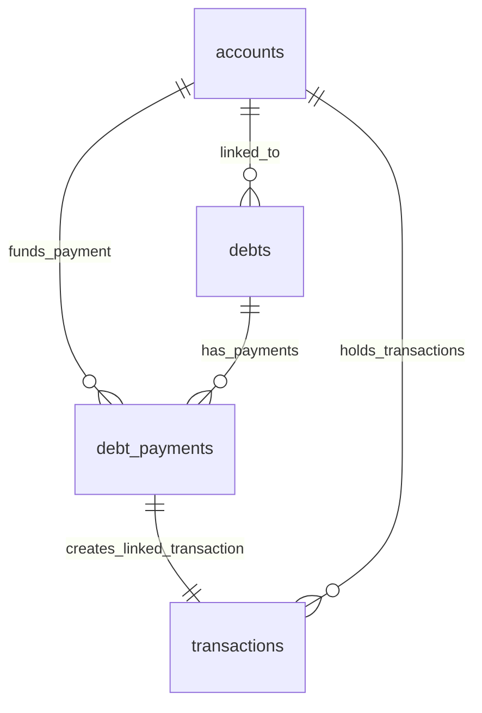
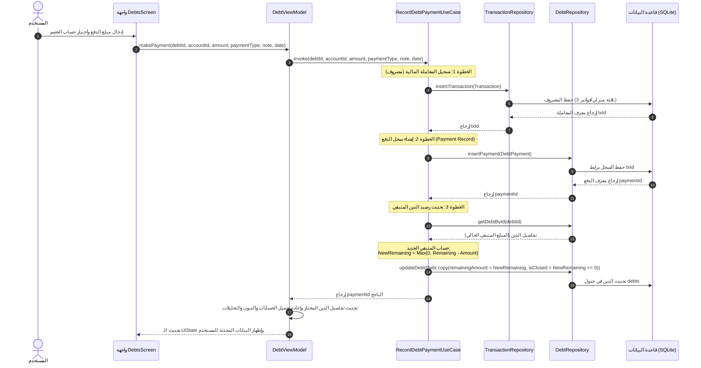
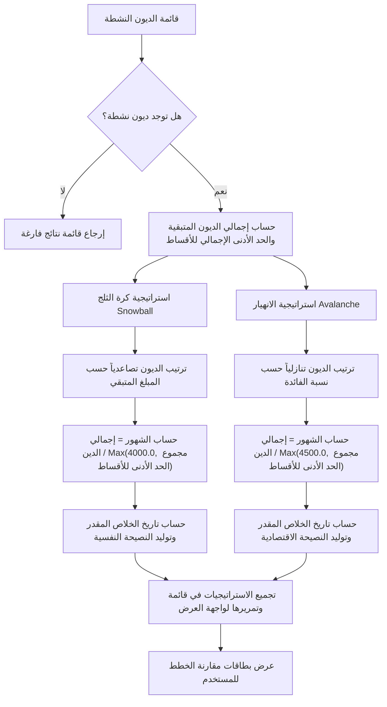

# دليل هندسة وتشغيل نظام الديون والالتزامات المالية في تطبيق FinTrack-DZ (Qdash)

يقدم هذا المستند شرحاً تفصيلياً وشاملاً لنظام إدارة الديون والالتزامات المالية في تطبيق **FinTrack-DZ (Qdash)**. يغطي الدليل بنية النظام البرمجية (Architecture)، قواعد البيانات (Database Schema)، مخططات سير البيانات والتفاعل (Mermaid Diagrams)، منطق العمليات المالية الحسابية، واستراتيجيات السداد المعتمدة.

---

## 1. نظرة عامة على النظام (System Overview)

صُمم نظام الديون لمساعدة المستخدمين على تتبع ديونهم والتزاماتهم المالية تجاه الآخرين (أو العكس)، ووضع خطط سداد ذكية بناءً على استراتيجيات مالية معترف بها عالمياً. يتميز النظام بالخصائص التالية:
* **التكامل التلقائي مع المحفظة**: عند تسديد أي جزء من الدين، يتم خصم القيمة تلقائياً من حساب المستخدم المالي المحدد وتسجيلها كمعاملة مصروفات (Expense) لضمان دقة الرصيد العام.
* **محاكاة ومقارنة خطط السداد**: يتيح التطبيق مقارنة فورية بين استراتيجيتي **كرة الثلج (Snowball)** و**الانهيار الجبلي (Avalanche)** للتنبؤ بتاريخ التخلص الكامل من الديون.
* **محرك النصائح الذكية**: يقوم بتحليل الديون المتبقية لتقديم نصائح مخصصة باللغة العربية (مثل تحديد الديون ذات الأولوية القصوى أو الديون الصغيرة التي يمكن تصفيتها كـ "فوز سريع").
* **تصدير التقارير**: توليد تقارير PDF تفصيلية لخطة سداد الديون.

---

## 2. بنية النظام البرمجية (System Architecture)

يتبع التطبيق بنية **الهندسة النظيفة (Clean Architecture)** ونمط **MVVM (Model-View-ViewModel)** مع استخدام **Jetpack Compose** للواجهات و**Room Database** للتخزين المحلي. يتم تقسيم الكود إلى أربع طبقات رئيسية:

```
[UI Screen: DebtsScreen] <---> [ViewModel: DebtViewModel]
                                    |
                        [Domain Layer: Use Cases]
                         - AddDebtUseCase
                         - RecordDebtPaymentUseCase
                         - GetDebtPlanUseCase
                         - CompareDebtStrategiesUseCase
                         - GetDebtInsightsUseCase
                         - CloseDebtUseCase
                                    |
                        [Repository Interface] <---> [Repository Impl]
                                                           |
                                                    [Data Layer: DAOs]
                                                     - DebtDao
                                                     - DebtPaymentDao
```

### أ. طبقة البيانات (Data Layer)
* **[NewDatabaseEntities.kt](file:///app/src/main/java/com/example/data/local/entities/NewDatabaseEntities.kt)**: يحتوي على الكيانات البرمجية لجداول قاعدة البيانات (`DebtEntity` و `DebtPaymentEntity`).
* **[NewDatabaseDaos.kt](file:///app/src/main/java/com/example/data/local/dao/NewDatabaseDaos.kt)**: يحدد دوال الاستعلام (Queries) الخاصة بالـ DAOs للتفاعل مع قاعدة البيانات المحلية عبر SQLite.
* **[DebtRepositoryImpl.kt](file:///app/src/main/java/com/example/data/repository/DebtRepositoryImpl.kt)**: يقوم بتنفيذ واجهة المستودع (Repository Interface)، واستدعاء الـ DAOs المناسبة، وتحويل الكيانات (Entities) إلى نماذج النطاق (Domain Models).

### ب. طبقة النطاق (Domain Layer - Business Logic)
* **[NewDomainModels.kt](file:///app/src/main/java/com/example/domain/model/NewDomainModels.kt)**: يحتوي على النماذج الأساسية (`Debt` و `DebtPayment` و `DebtStrategyResult` و `DebtPaymentType`).
* **[DebtRepository.kt](file:///app/src/main/java/com/example/domain/repository/DebtRepository.kt)**: واجهة برمجية تحدد العمليات المتاحة لإدارة الديون والمدفوعات دون الاعتماد على آلية التخزين.
* **[DebtUseCases.kt](file:///app/src/main/java/com/example/domain/usecase/debt/DebtUseCases.kt)**: يحتوي على حالات الاستخدام (Use Cases) التي تنفذ منطق العمل التجاري للديون.

### ج. طبقة العرض (Presentation Layer - UI)
* **[DebtViewModel.kt](file:///app/src/main/java/com/example/presentation/debt/DebtViewModel.kt)**: يدير حالة الواجهة (`DebtUiState`)، ويجمع البيانات بشكل تدفقي تفاعلي (Flows)، ويوفر الدوال اللازمة لمعالجة أحداث المستخدم (إضافة دين، دفع قسط، تغيير استراتيجية).
* **[DebtsScreen.kt](file:///app/src/main/java/com/example/presentation/debt/DebtsScreen.kt)**: يمثل واجهات العرض المبنية بـ Jetpack Compose، والتي تنقسم إلى مركز الديون الرئيسي (Debts Main Hub) وشاشة تفاصيل الدين وجدول المدفوعات (Debt Details Content).

---

## 3. هيكل قاعدة البيانات (Database Schema)

يتكون نظام الديون من جدولين أساسيين في قاعدة البيانات المحلية:

### أ. جدول الديون (`debts`)
يخزن البيانات الأساسية لكل دين أو التزام مالي.

| اسم الحقل | نوع البيانات | الوصف |
| :--- | :--- | :--- |
| `id` | `Long` (مفتاح أساسي تلقائي) | المعرف الفريد للدين |
| `title` | `String` | عنوان أو اسم الدين (مثل: قرض بنكي) |
| `creditorName` | `String` | اسم الجهة الدائنة |
| `totalAmount` | `Double` | القيمة الإجمالية للدين عند إنشائه |
| `remainingAmount` | `Double` | المبلغ المتبقي غير المسدد من الدين |
| `interestRate` | `Double?` (اختياري) | نسبة الفائدة السنوية أو الإضافية |
| `dueDate` | `Long?` (اختياري) | تاريخ استحقاق الدين (مخزن كطابع زمني) |
| `minimumPayment` | `Double` | الحد الأدنى للدفع الملتزم به دورياً |
| `recommendedPayment` | `Double?` (اختياري)| الدفعة الموصى بها لتسريع السداد |
| `paymentFrequency` | `String` | دورية الدفع ("MONTHLY", "WEEKLY", "MANUAL") |
| `linkedAccountId` | `Long?` (مفتاح أجنبي اختياري) | الحساب المالي المرتبط بالدين |
| `priority` | `Int` | درجة الأهمية/الأولوية (كلما قل الرقم زادت الأولوية) |
| `notes` | `String?` (اختياري) | ملاحظات إضافية حول الدين |
| `color` | `String` | كود اللون البصري المخصص للدين (Hex Code) |
| `icon` | `String` | اسم الأيقونة المخصصة للدين |
| `createdAt` | `Long` | تاريخ تسجيل الدين في النظام (طابع زمني) |
| `isClosed` | `Boolean` | حالة الدين (مغلق ومسدد بالكامل أم لا) |

### ب. جدول مدفوعات الديون (`debt_payments`)
يخزن تفاصيل كل عملية سداد أو قسط تم دفعه لصالح دين معين.

| اسم الحقل | نوع البيانات | الوصف |
| :--- | :--- | :--- |
| `id` | `Long` (مفتاح أساسي تلقائي) | المعرف الفريد لعملية الدفع |
| `debtId` | `Long` (مفتاح أجنبي) | معرف الدين المرتبط بالدفعة |
| `accountId` | `Long` (مفتاح أجنبي) | الحساب المالي الذي تم الخصم منه |
| `amount` | `Double` | قيمة المبلغ المدفوع |
| `paymentDate` | `Long` | تاريخ تنفيذ الدفعة (طابع زمني) |
| `paymentType` | `String` | نوع الدفعة ("MINIMUM", "EXTRA", "MANUAL", "SCHEDULED") |
| `note` | `String?` (اختياري) | ملاحظات المستخدم حول الدفعة |
| `linkedTransactionId` | `Long?` (مفتاح أجنبي اختياري)| معرف المعاملة المالية المنشأة في جدول المصاريف |
| `createdAt` | `Long` | تاريخ التسجيل الفعلي للعملية (طابع زمني) |

---

## 4. المخططات التوضيحية (Visual Diagrams)

### أ. مخطط علاقات الجداول والكيانات (ER Diagram)
يوضح المخطط التالي العلاقة بين جداول الديون، المدفوعات، المعاملات، والحسابات المالية:



### ب. مخطط تتابع عملية تسديد قسط (Sequence Diagram)
يوضح هذا المخطط الخطوات التفصيلية التي تتم عند قيام المستخدم بتسجيل دفعة دين جديدة وتأثيرها على بقية النظام:



### ج. مخطط مقارنة استراتيجيات السداد (Flowchart Diagram)
يوضح سير العمليات داخل محرك محاكاة ومقارنة خطط سداد الديون:



---

## 5. منطق العمليات واستراتيجيات السداد (Core Business Logic)

يحتوي ملف `DebtUseCases.kt` على تفاصيل منطق العمليات الحسابية والاستراتيجيات كما يلي:

### أ. تسجيل المدفوعات والربط التلقائي
في دالة `RecordDebtPaymentUseCase`:
1. يتم جلب تفاصيل الدين للتحقق من وجوده.
2. يتم تسجيل معاملة سداد دين في جدول المعاملات المالي (`transactions`) بقيمة الدفعة كـ **مصروف (EXPENSE)** مربوطاً بالحساب المختار ومعرف الفئة `3L` (والذي يمثل الفئة الافتراضية للفواتير والالتزامات المنزلية)، مع كتابة الملاحظة تلقائياً بصيغة: `"تسديد دين: [عنوان الدين]"`.
3. يتم إدراج سجل السداد في جدول `debt_payments` وحفظ رابط المعاملة المالي المولد `linkedTransactionId`.
4. يتم طرح قيمة المدفوع من المبلغ المتبقي للدين، وإذا وصل الصافي إلى الصفر أو ما دونه، يُعلم الدين تلقائياً بأنه مغلق (`isClosed = true`).

```kotlin
val newRemaining = maxOf(0.0, debt.remainingAmount - amount)
debtRepository.updateDebt(
    debt.copy(
        remainingAmount = newRemaining,
        isClosed = newRemaining <= 0.0
    )
)
```

### ب. محاكاة استراتيجيات التخلص من الديون
يتيح كلاس `CompareDebtStrategiesUseCase` حساب ومحاكاة خطتين رئيسيتين:
1. **استراتيجية كرة الثلج (Snowball)**:
   * **الفكرة**: ترتيب الديون من الأصغر قيمة متبقية إلى الأكبر.
   * **الحساب**: تُقدر مدة السداد بالشهور بقسمة إجمالي الديون المتبقية على القيمة الأكبر بين الحد الأدنى الإجمالي للمدفوعات أو `4000.0 د.ج`.
   * **الهدف**: تعزيز الجانب النفسي والتحفيزي للمستخدم عبر إغلاق ملفات الديون الصغيرة أولاً وبسرعة.
2. **استراتيجية الانهيار الجبلي (Avalanche)**:
   * **الفكرة**: ترتيب الديون تنازلياً من الأكثر كلفة (التي تمتلك أعلى نسبة فائدة) إلى الأقل.
   * **الحساب**: تُقدر مدة السداد بالشهور بقسمة إجمالي الديون المتبقية على القيمة الأكبر بين الحد الأدنى الإجمالي للمدفوعات أو `4500.0 د.ج`.
   * **الهدف**: توفير المال والحد من الفوائد المتراكمة على المدى الطويل.

---

## 6. نظام النصائح والتوصيات الذكية (Smart Insights)

يوفر كلاس `GetDebtInsightsUseCase` إرشادات فورية بناءً على خوارزمية فحص سريعة لحالة الديون:
* **حالة الخلو من الديون**: إذا لم تكن هناك ديون نشطة، تظهر للمستخدم رسالة تهنئة تشجيعية: `"الحمد لله، لا توجد ديون معلقة أو التزامات متأخرة حالياً."`
* **حالة وجود ديون نشطة**:
  1. حساب وعرض إجمالي المبالغ المطلوبة للسداد بشكل واضح بالدينار الجزائري (د.ج).
  2. فحص الديون والبحث عن القرض ذي الأولوية الأعلى (المفتاح الأصغر في حقل `priority`) والتوصية بسداده أولاً لحساسيته: `"نوصي بوضع الأولوية لتسوية '[اسم الدين]' للدائن '[اسم الدائن]'."`
  3. البحث عن أصغر دين كقيمة متبقية (`remainingAmount`) والتوصية به كهدف سهل (Quick Win): `"يمكنك تصفية وغلق '[اسم الدين]' سريعاً لتقليص عدد الدائنين وتصفية ذهنك."`

---

## 7. آلية تصدير خطة السداد إلى PDF
يوفر كلاس `ExportDebtPdfUseCase` إمكانية استدعاء `ExportRepository` لتوليد تقارير PDF بتنسيق منسق. يتم ذلك بإرسال طلب `ExportReportRequest` يحتوي على التفاصيل التالية:
* نوع التقرير: `reportType = "DEBT_REPAYMENT_PLAN_REPORT"`
* تفعيل حقل الديون: `includeDebtSection = true`
* إغلاق أقسام التوفير والمعاملات العادية لتركيز التقرير بالكامل على خطة الدفع وهيكل الديون النشطة وتاريخ التخلص المتوقع منها.
* دعم اللغتين العربية والفرنسية/الإنجليزية لتناسب تفضيلات المستخدم الجزائري.
