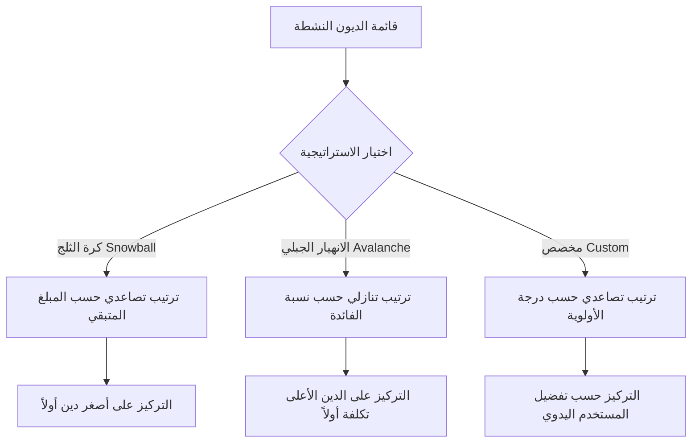
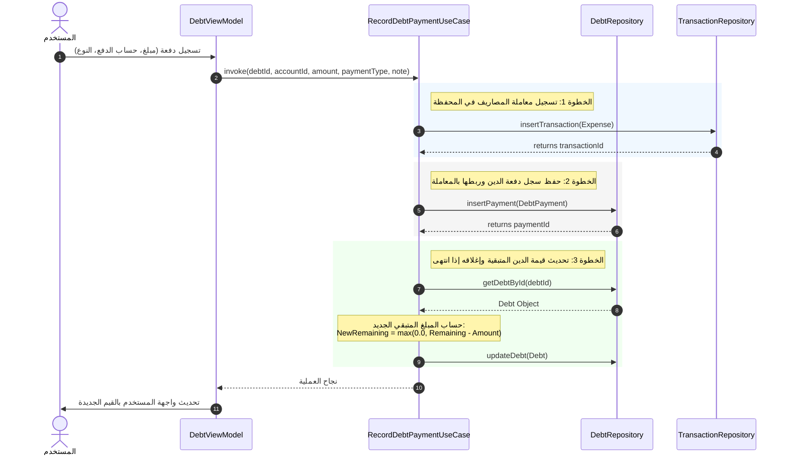
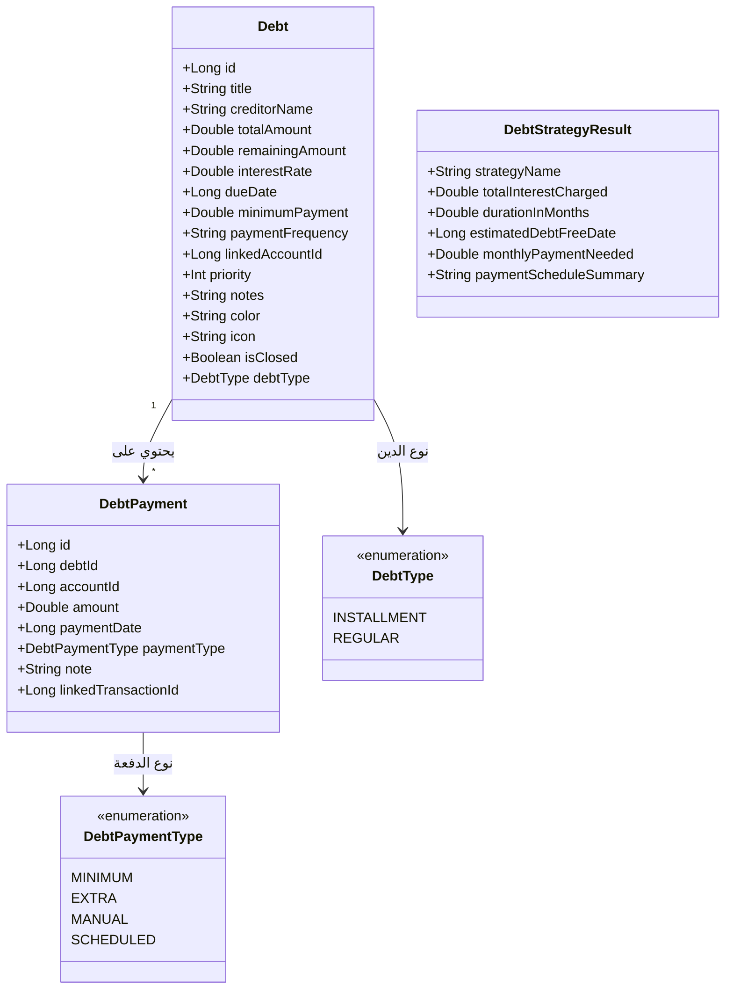

# دليل آلية عمل خطة إدارة الديون وسدادها في تطبيق FinTrack-DZ (Qdash)

يهدف نظام إدارة الديون في تطبيق **FinTrack-DZ** إلى تمكين المستخدمين من تتبع التزاماتهم المالية وجدولة سدادها بفعالية باستخدام منهجيات علمية معترف بها عالمياً. يوفر هذا الدليل شرحاً مفصلاً للمكونات التقنية والمالية للنظام، بالإضافة إلى مخططات توضيحية لآلية العمل.

---

## 1. أنواع الديون المدعومة (`DebtType`)

ينقسم نظام الديون في التطبيق إلى نوعين رئيسيين لتغطية كافة الحالات المالية للمستخدم:

| نوع الدين | الوصف | الخصائص التقنية |
| :--- | :--- | :--- |
| **دين مقسط (`DebtType.INSTALLMENT`)** | الديون المنظمة بقسط دوري محدد (مثل القروض البنكية، التقسيط التجاري). | يحتوي على دفعات دنيا (`minimumPayment`)، نسبة فائدة (`interestRate`)، وتكرار دفع دوري. |
| **دين عادي (`DebtType.REGULAR`)** | الديون الشخصية المرنة أو السلف البسيطة التي لا تخضع لفوائد أو أقساط ثابتة. | لا يحتوي على نسبة فائدة، الدفعة الدنيا تكون `0.0` وتكرار السداد يكون غير محدد (`NONE`). |

---

## 2. استراتيجيات سداد الديون وطرق الترتيب (`GetDebtPlanUseCase`)

يقوم التطبيق بترتيب الديون وجدولتها وفقاً لثلاث طرق رئيسية يختار المستخدم بينها لتحديد أي الديون يجب البدء بسدادها أولاً:

### أ. استراتيجية كرة الثلج (`Debt Snowball`)
* **آلية الترتيب**: ترتيب الديون تصاعدياً حسب المبلغ المتبقي (`remainingAmount`).
* **الأثر النفسي**: تهدف هذه الاستراتيجية إلى تحقيق نجاحات سريعة للمستخدم من خلال إغلاق الديون الصغيرة بسرعة، مما يمنحه دافعاً معنوياً للاستمرار.

### ب. استراتيجية الانهيار الجبلي / سيل العرم (`Debt Avalanche`)
* **آلية الترتيب**: ترتيب الديون تنازلياً حسب نسبة الفائدة (`interestRate`).
* **الأثر المالي**: تهدف هذه الطريقة إلى تقليل التكلفة الإجمالية للديون عبر التخلص من الديون ذات الفوائد المرتفعة أولاً، مما يوفر أموال الفوائد التراكمية.

### ج. الاستراتيجية المخصصة (`Custom`)
* **آلية الترتيب**: ترتيب الديون تصاعدياً حسب حقل الأولوية (`priority`) الذي يحدده المستخدم يدوياً أثناء إضافة الدين.

---

## 3. آلية الحساب والمقارنة بين الاستراتيجيات (`CompareDebtStrategiesUseCase`)

يقوم التطبيق بمقارنة الاستراتيجيات وحساب الفترات الزمنية المتوقعة لكل منها:

### المعادلات الحسابية

1. **إجمالي الدين المقسط النشط ($D_{total}$)**:
   $$D_{total} = \sum (\text{remainingAmount} \quad \text{حيث الدين غير مغلق ومن نوع INSTALLMENT})$$

2. **الحد الأدنى الإجمالي للمدفوعات ($P_{min\_total}$)**:
   $$P_{min\_total} = \sum (\text{minimumPayment})$$

3. **عدد الأشهر المتوقعة للسداد في خطة كرة الثلج ($M_{snowball}$)**:
   $$M_{snowball} = \frac{D_{total}}{\max(4000.0, P_{min\_total})}$$
   *حيث يتم استخدام القيمة الثابتة `DebtConstants.DEFAULT_SNOWBALL_DIVISOR = 4000.0` كحد أدنى للمقسوم عليه لحماية الحسابات من القسمة على صفر أو مبالغ ضئيلة جداً.*

4. **عدد الأشهر المتوقعة للسداد في خطة الانهيار الجبلي ($M_{avalanche}$)**:
   $$M_{avalanche} = \frac{D_{total}}{\max(4500.0, P_{min\_total})}$$
   *حيث يتم استخدام القيمة الثابتة `DebtConstants.DEFAULT_AVALANCHE_DIVISOR = 4500.0` كحد أدنى للمقسوم عليه.*

5. **تاريخ التخلص المتوقع من الديون ($Date_{free}$)**:
   $$\text{Timestamp}_{free} = \text{CurrentTimeMillis} + (M \times 30 \times 24 \times 60 \times 60 \times 1000)$$

---

## 4. دورة حياة سداد الدين وتأثيرها على النظام (`RecordDebtPaymentUseCase`)

عندما يقوم المستخدم بتسجيل دفعة سداد لدين معين، تتم العملية بشكل متكامل عبر الخطوات التالية:

### الأثر على البيانات والنظام:
1. **تحديث الحساب البنكي / المحفظة**: يتم خصم مبلغ السداد تلقائياً من الحساب المحدد عن طريق إدراج معاملة سحب (`EXPENSE`) تحت المعرف المخصص للديون (`DebtConstants.DEBT_EXPENSE_CATEGORY_ID`).
2. **إغلاق الدين تلقائياً**: إذا تساوت الدفعات أو تجاوزت المبلغ المتبقي، يتم تعيين حقل `isClosed = true` للمستند، وينقل الدين إلى قائمة الديون المغلقة/المسددة.

---

## 5. مخطط العلاقات البرمجية (`Domain Model Schema`)

يوضح المخطط التالي العلاقة بين الكيانات البرمجية الأساسية في نظام الديون:

---

## 6. نصائح ذكية مدمجة في التطبيق (`Debt Insights`)

يقدم التطبيق نصائح وإرشادات ديناميكية للمستخدم بناءً على حالة ديونه:
* **تصفية سريعة**: يوصي التطبيق بتصفية الدين الأقرب للانتهاء لتفريغ ذهن المستخدم وتقليل عدد الدائنين.
* **الأولوية القصوى**: يوجه التطبيق التركيز نحو الدين الذي يمتلك أعلى أولوية تم ضبطها يدوياً.
* **التهنئة بالخلو من الديون**: عند سداد جميع الديون، تظهر رسالة تهنئة تشجيعية للمستخدم.
